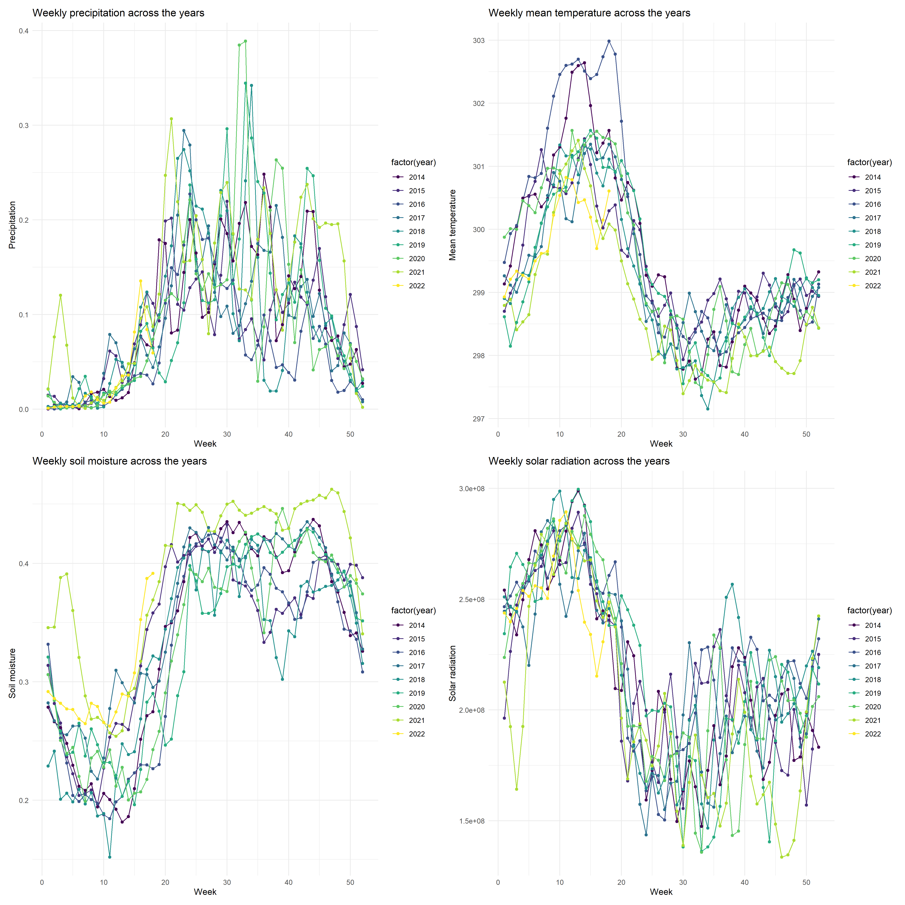

Dear Editor,

We are pleased to submit a revised version of our manuscript, "Long-term citizen science data reveals environmental correlates of tropical tree flowering at the regional scale" (IJBM-D-26-00015) for consideration for publication in International Journal of Biometeorology. 
We have addressed all points raised by the reviewers as detailed in our responses to the reviewers. 
The most significant changes were introducing more recent references, especially in the Indian context, as well as updating some methodological details and improving figure clarity.
Finally, we have removed the hot/cold spot analysis from the manuscript, based on the recommendations of two reviewers.

Thank you for considering this revised version for publication. 
We look forward to your response.

Sincerely,
On behalf of all coauthors,  
Krishna Anujan

\newpage

## Reviewers' comments:

### Field Editor:  Please consider the following concerns:

1) From a reader's perspective the amount of information provided in the Supplementary information and reference made to it, is tedious.

**Response: Thanks for the comment. Given that this is the first large-scale analysis using this data, we wanted to provide enough information in the supplementary material for reproducibility. We have now simplified the references to the sections and figures in the supplementary appendix.**

2) For example, the geographical location of the trees was difficult to follow - information on this was provided only in the supplement.

**Response: We have added a line to clarify the geographical location of the trees. "In total, these three species had 165006 observations across 19596 trees with recorded or verifiable locations, distributed across the state of Kerala (Fig 1, Appendix S1: Table S1)."**

3) The amount of text devoted to the methods compared to results makes it an unbalanced paper to read.

**Response: Thanks for bringing this to our attention. We have now removed the methods on hotspot analyses, which should balance the paper a bit more. However, we are open to suggestions on how to balance it further.**

4) The inclusion of hot/cold spots in the paper was not expected from the title. It also doesn't fit with the rest of the paper. This part of the paper should be removed.

**Response: Thank you for this suggestion. Based on your recommendation and that of another reviewer, we have now removed this analysis from the paper.**

5) Compared to other parts of the world the phenological literature from India is sparse.

**Response: We acknowledge this limitation and have included a few more recent references, including a few from India such as @jose_plugging_2023, @menon_phenological_2025 and @madhavan_phenology_2026. However, phenological studies in India, especially for reproductive phenology, remain limited, and our work contributes to filling this gap.** 

### Reviewer #1

An excellent study! Well done to the authors. I have only a few minor comments, but it is important that these be adequately addressed.

**Response: Thank you for your favourable review of our research. We have addressed your comments and now and provide detailed responses below.**

1) much of the literature cited makes the manuscript read as though it was written in 2018/2019 and then left on a back shelf. Please update this throughout to include more recent literature. There is also valuable older literature that has been omitted yet would provide a stronger base for this paper.

**Response: We have updated the citations to include more recent literature.**

2) The reporting of the geographical coordinates of Kerala is puzzling. Ordinary a range of latitude is presented followed by a range of longitude. For an international journal, including the bordering countries of India in the study site map would be useful, as would the inclusion of the geographic coordinates.

**Response: We have updated the description of the geographical coordinates. We have also included bordering countries of India in the study site map.**

3) Your ethics statement indicates that this is covered by broader citizen science campaign. It is important to determine whether this was covered by any institutional ethics clearance and the protocols covered therein.

**Response: The SeasonWatch project is currently housed at the Nature Conservation Foundation. While there is no ethical clearance requirement from the institution, the project adheres to strict ethical best practices followed by citizen science projects worldwide (following FAIR data principles). Since participation in the project is completely voluntary, the SeasonWatch privacy and data policy (https://www.seasonwatch.in/privacy-policy/) details efforts of protecting contributor privacy and data sharing/attribution. SeasonWatch also mankes data available publicly for research and education purposes (on GBIF) with explicit consent from contributors.**

4) it would be good to see greater engagement with the literature through the discussion section and a distinct conclusion section

**Response: We have improved the discussion section with more recent references and a distinct conclusion section.**

### Reviewer #2: 

Title: Long-term citizen science  data reveals environmental correlates of tropical tree
flowering at the regional scale  suggest changing correlates to influences. Also the parameters examined are climate. This is more a precise description.

**Response: Thanks for this comment. We have updated the title to read: "Long-term citizen science data reveals climate influences of tropical tree flowering at the regional scale"**

Line 41: temperature is one of, if not the most common influence on flowering hence a reference to this should be included

**Response: Thank for you for pointing this out. We have addded temperature and a reference.**

Line 44: what do the authors mean by persistence

**Response: By persistence, we mean duration or the observation of a phenophase continuing over time after onset. We have changed this to "duration".**

Line 50 to 53 While landscape-level phenological shifts in temperate regions have been studied over decades, large gaps remain in ecological documentation and predictions for shifts in the reproductive phenology of tropical trees. Requires a reference.

**Response: We have added a reference.**

Line 56 to 58:  this sentence misses the work of SJ Wright and colleagues e.g. A phenology model for tropical species that flower multiple times each year

**Response: Thank you, we have added this.**

Line 60: as with line 44 having defined persistence 

**Response: We have changed this to "duration" as well.**

Line 72: "at least six years of data is necessary to accurately detect phenology in regularly flowering species"  This related only to detecting the cycle of flowering - not about the influence of climate

**Response: Thank you for pointing this out. We have revised this sentence.**

Line 93  helped quantify advancing spring behaviours of plant species in North America. The references provided are not appropriate.   Brunsdon and Comber data set covers the period 1956 to 2003. US NPN did not commence until 2007. The Schwartz et al reference is about the establishment of the USNPN.

**Response: Thank you for pointing this out. We have updated these references to remove Brundson and Comber 2012 but included a recent review and a neat ecological study @crimmins_science_2022 and @gallinat_combined_2026.**

Line 96: include when SeasonWatch was established.

**Response: SeasonWatch was established in 2010. We have now included this information.**

Line 101; italicise Cassia fistula

**Response: Thank you, we have fixed this.**

Line 105: Suggest changing correlates to influences - some readers may associate correlates with correlation.

**Response: Thank you, we have fixed this.**

Line 108: generalised linear mixed model approaches

**Response: Thanks, we have fixed this.**

Line 132-133: Two decimal places do not seem warranted for the % of observations. In relation to data on variability  more information is required. The authors could include what the ranges are.

**Response: Thank you, we have fixed the decimal issue. For the description of variability, since this information might be too quantitative for the introduction, we have altered the sentence to read: "These data span a large geographic range in the state, potentially capturing environmental variability in terms of rainfall, temperature, elevation."**

Line 149  a subheading to guide the reader here would be of benefit.

**Response: Thanks for this suggestion. We have now included a subheading.**

Line 152: What do the authors mean by trouble shooting.

**Response: SeasonWatch uses a web-based platform for data entry. By troubleshooting, we mean identifying and resolving issues that may arise during data entry or submission, including standardising observations across different users through training and guidelines.**

Line 202 and 206: The authors state they used " NASA nightlights layer from 2016 at the 500 m resolution as a proxy for the degree of urbanisation" but provide not any detail how this was interpreted.

**Response: We used the nightlights layer directly, scaled to the range of observations across sites in 2016, to provide a measure of urbanisation. We have updated the methods to add: "We scaled the nightlights value across the range of observations in our dataset to provide a relative measure of urbanisation across the state."**

Line 246 - 249. The supplementary indicates that each variable had a fortnightly, monthly, and quarterly parameter - so which of these was the most important?

**Response: We used fortnightly parameters as this was finest scale available.**

Line 281: Based on the title a reader is not expecting this. This is very different to the rest of the paper and as a consequence doesn't fit. Suggest that this part of the paper is excluded.

**Response: Thank you for this suggestion. Based on your recommendation and that of another reviewer, we have now removed this analysis from the paper.**

Line 357-358: Pearson's correlation coefficients  for predicted vs observed for jackfruit and mango across these runs 0.011, 0.031. This is the first time that this method is mentioned. This should be in the methods.

**Response: Thank you for noticing this omission. We have included reference to the method in the LOOCV section of the methods. This now reads: "We then used the model coefficients to predict these “new” observations and tested their accuracy using Pearson's correlation coefficient between predicted and observed values, and then tested for reliability of predicted values using F1 scores."**

Line 401: "is associated with recent, local climatic conditions" - do the authors mean fortnightly?

**Response: Yes, we have added this detail.**

Line 415: However, our study spans nine years of observations, more than the minimum recommended 6 years for tropical species (Bush et al. 2018). Bush indicated 'Power analysis of the Lopé field data shows that at least 6 years of data are needed for confident detection of the least noisy species, but this varies and is often >20 years for the most noisy species'. This paper was about flowering cycles and not climate influences. Hence this sentence needs to be rewritten.

**Response: We have now revised the sentence to reflect this. It now reads: "However, our study spans nine years of observations, more than the minimum recommended six years to identify flowering cycles in regularly floweringtropical species [@bush_effective_2018], and the spatial extent of the dataset is much larger compared to the limitations of long-term cohort monitoring (often restricted to a site) allowing us to extend inferences to large spatial scales. However, given that spatial variability adds noise to the dataset, long-term data collection is crucial to reliably estimate flowering cycles and their climatic influences."**

Tables
Italicise species names

**Response: Thanks for noticing this, we have fixed this.**

Figures: the lack of clarity of figures 1,4,5 make them very difficult for the reader. Figure 5 is particularly difficult to interpret many of the items in the legend are not distinguishable in the a, b and c. The scale is not readable.

**Response: We have removed Figure 5 from the paper, based on reviewer feedback.**

Supplementary Material
Section S2:
Does with "help from the field coordinator for Kerala" in the paragraph mean that the coordinator spoke to the user and located the tree/s? How many of records does this method represent?

Finally, if no trees by the user had accurate lat/long values and if they were by users who can be located through Google maps (schools or other institutions), we used a geocoding software on Google Sheets, Awesome Table Geocode, to fill these values. We then manually validated these with help from the field coordinator for Kerala. We excluded observations that could not be filled or verified by these methods.

**Response: Most of the trees in the SeasonWatch dataset for Kerala are associated with schools or other institutions. The field coordinator was able to confirm the locations of these institutions, which were used to cross-verify the locations of the trees. We were not able to gap-fill locations of trees which were recorded by individual users, and hence were excluded from the analysis.**

Figure S6: the colours chosen for the different years make it impossible to distinguish years. The legend has a graduation of colours for years with only even years indicated.

**Response: We have now updated this figure with a clearer colour scheme and a legend that shows all years, instead of a gradient.**

Figure S7: why aren't min and mean temp included. Is SM, mean Soil Moisture

**Response: We had originally included only correlations between variables assessed in the GLMM models. However, we now include mean and min temperature as well. SM is soil moisture; we have clarified the abbrevations now.**

Fig s9: Uniformity of residuals has no figure associated with the caption.

**Response: Thank you for pointing this out. We have updated the model diagnostics figures now showing the residuals.**

Section S4. Whole equation not visible phenophasel,t ∼ precipitationl,t+maximumtemperaturel,t+minimumtemperaturel,t+meantemperaturel,t+drydaysl,t+so

**Response: Thanks for noticing this rendering error. We have fixed this.**

The statement "Tree-based methods are fairly insensitive to collinearity among predictors" needs greater justification/clarification.
For the variables importance figure it only has "minimum temperature', 'Soil moisture' etc not whether they were fortnightly, monthly or quarterly. Shouldn't this be indicated?

**Response: We had indicated that these were values calculated at the fortnightly scale, in the text above the figure and after the equation - "Where precipitation, temperature, dry days, soil moisture, solar radiation are temporal predictors for the fortnight before the observation at location $l$ and time $t$." We have now also indicated that at the figure.**

