```{r setup, include=FALSE}
knitr::opts_chunk$set(echo = TRUE)

# Appendices

confusion_matrix_appendix_title <- "Section S4. Supplementary methods and results for ML modelling"
env_vars_appendix_title <- "Section S3. Environmental variable methods"
data_cleaning_methods_title <- "Section S2. Supplementary methods for data cleaning"
sp_description_title <- "Section S1. Species descriptions and SeasonWatch observations"
glmm_results_appendix_title <- "Section S5. Supplementary results for GLMMs"
glmm_loocv_appendix_title <- "Section S6. Leave-one-out cross validation for GLMMs"
hotspot_appendix_title <- "Section S7. Supplementary methods and results for hotspot analysis"


# SI table numbers

# SI table captions
species_description_legend <- "Table S1. Species descriptions.**Taxonomic description, appearance of tree and reproductive parts, phenology in Kerala and description of the SeasonWatch dataset for jackfruit, mango and tamarind"

jack_variable_importance_legend <- "Table S2. Variable importance across each of the LOOCV models for jackfruit"
mango_variable_importance_legend <- "Table S3. Variable importance across each of the LOOCV models for mango"
tam_variable_importance_legend <- "Table S4. Variable importance across each of the LOOCV models for tamarind"

jack_ests_legend <- "Table S5. Model coefficients for flowering onset in jackfruit"
mango_ests_legend <- "Table S6. Model coefficients for flowering onset in mango"
tam_ests_legend <- "Table S7. Model coefficients for flowering onset in tamarind"

# jack_month_legend <- "Table S8. Model coefficients for flowering onset in jackfruit with month as a predictor"
# mango_month_legend <- "Table S9. Model coefficients for flowering onset in mango with month as a predictor"
# tam_month_legend <- "Table S10. Model coefficients for flowering onset in tamarind with month as a predictor"

jack_estsloocv_legend <- "Table S8. Model coefficients for LOOCV models of flowering onset in jackfruit"
mango_estsloocv_legend <- "Table S9. Model coefficients for LOOCV models of flowering onset in mango"
tam_estsloocv_legend <- "Table S10. Model coefficients for LOOCV models of flowering onset in tamarind"
jack_mse_legend <- "Table S11. Out-of-bag predictive power for LOOCV models of flowering onset in jackfruit"
mango_mse_legend <- "Table S12. Out-of-bag predictive power for LOOCV models of flowering onset in mango"
tam_mse_legend <- "Table S13. Out-of-bag predictive power for LOOCV models of flowering onset in tamarind"


# stcube_legend <- "Table S17. Space-time cube characteristics from hotspot analysis of climate variables"

# SI figure numbers

variable_imp_fig_legend <- "Figure S8. Variable importance for environmental variables at the fortnightly scale from machine learning models of flowering occurrence. Mean Decrease in Accuracy from Random Forest models of the probability of observing flowering in a) jackfruit, b) mango, c) tamarind. Variable importance has been calculated at each LOOCV run, Length of the bars represent mean MDA across the runs and variables are ordered in their decreasing order of mean importance. Thick black error bars represent 1 standard deviation from the mean and the thin bars represent 1.96 standard deviation from the mean across the runs."

confusion_matrix_legend <- "Figure S9. Confusion matrices with Random Forest models"
env_corrs_legend <- "Figure S7. Correlations between environmental variables at different timescales from 2014-2022. Prefix fn_, mn_ and qr_ respectively denote fortnightly, monthly and quarterly variables. Variables are as follows: pcp = precipitation, maxtemp = maximum temperature, mintemp = minimum temperature, meantemp = mean temperature, SM = soil moisture, DryDays = number of consecutive dry days."

jack_diag_legend <- "Figure S10. GLMM diagnostics for onset of flowering in jackfruit"
mango_diag_legend <- "Figure 11. GLMM diagnostics for onset of flowering in mango"
tam_diag_legend <- "Figure S12. GLMM diagnostics for onset of flowering in tamarind"

obs_yr_legend <- "Figure S1. Data distribution of all SeasonWatch observations for the top three species in Kerala across the years. a) Total number of observations including regular and casual b) Number of trees in these observations"
obs_yr0_legend <- "Figure S2. Data distribution of SeasonWatch observations with a 0 flowering observation in the previous week for the top three species in Kerala across the years. a) Total number of observations (includes only regular because casual observations do not have previous week's observation) b) Number of trees in these observations"
reg_obs_legend <- "Figure S3. Distribution of regular observations of the top three species in Kerala across the years."
onset_yr_legend <- "Figure S4. Number of years with observed onset record for each tree"
uninterrupted_legend <- "Figure S5. Distribution of trees with uninterrupted flowering record"
weekly_clim_legend <- "Figure S6. Mean weekly climate observations across locations where trees have been observed in Kerala through SeasonWatch"

# https://github.com/EcoClimLab/Operations/blob/master/Data_Management-Scientific_Workflow/manuscript_prep_with_Rmd.md
```

***Journal:*** Ecological Applications

***Authors:*** Krishna Anujan^1,2^*, Jacob Mardian^3^, Carina Luo^3^, Ramraj Rajakumar^3^, Hana Tasic^3^, Nadia Akseer^3^, Geetha Ramaswami^1^

***Affiliations:***  
^1^ SeasonWatch, Nature Conservation Foundation, 1311, “Amritha”, 12th Main, Vijayanagar 1st Stage, Mysore 570017, India  
^2^ Department of Ecology, Evolution and Environmental Biology, Columbia University in the City of New York, 1110 Amsterdam Ave, New York, NY 10025, United States   
^3^ Modern Scientist Global, 110 James Street, Suite 101, St. Catharines, Ontario L2R 7E8, Canada  
* corresponding author. Email: krishna.anujan@gmail.com

\newpage

## `r sp_description_title`

<!----The jackfruit tree is evergreen and monoecious with minute, yellowish-green flowers and green fruits with yellow to orange fleshy perianths inside (Kishen, 2005; @sasidharan_illustrated_2006). Mango trees have polygamous flowers that are yellowish-green and a fleshy fruit that is green when unripe and yellowish-red when ripe. Tamarind trees have small, bisexual flowers that are yellow with reddish-pink dots. 
The fruit is a pod about 10-15 cm long, with a hard wall and fleshy mesocarp inside that are both green when unripe and brown when ripe. --->
`r species_description_legend`
```{r eval = TRUE, echo=FALSE, warning=FALSE, message=F}
library(knitr)
library(kableExtra)
library(tidyverse)
library(flextable)
# set_flextable_defaults(font.family = "Arial", font.size = 9)
species_table <- read.csv("display/species_table.csv", stringsAsFactors = FALSE, check.names = FALSE)[1:9, ]
colnames(species_table)[1] <- " "
ft <- flextable(species_table)
ft <- autofit(ft)
ft <- width(ft, 1, width = 1.2)
ft <- width(ft, 2:4, width = 2)
# ft<-hline(ft, i=c(9,10))
ft <- vline(ft, j = 1)
# border_inner_h()
# ft<-surround(ft, i=10, border.top = std_border, border.bottom=std_border)
# ft <- width(ft, 5, width = 1.5)
ft
```


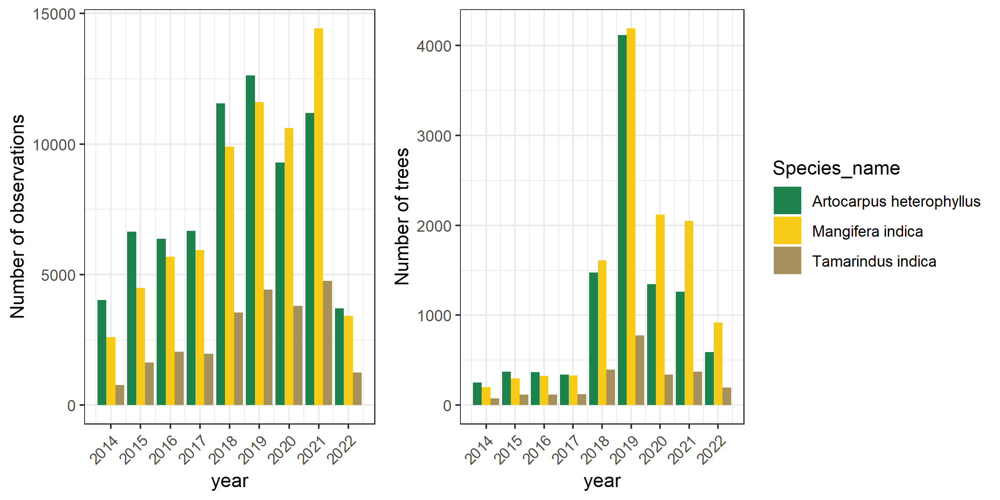

`r obs_yr_legend`

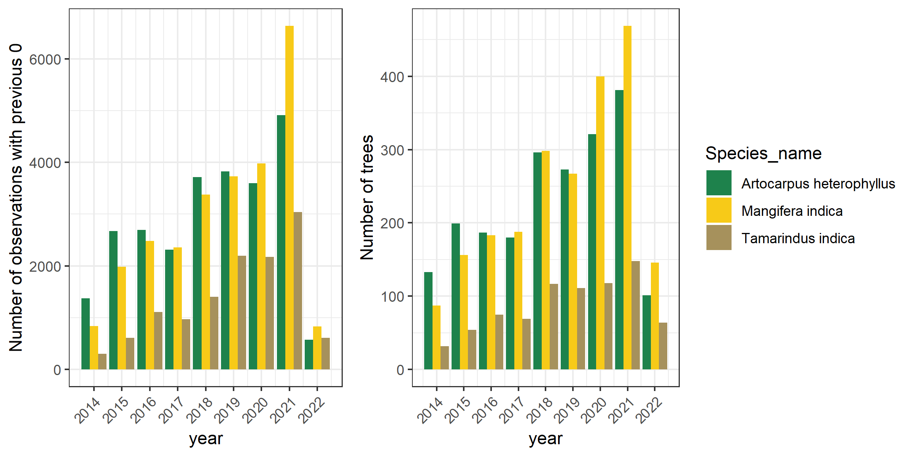

`r obs_yr0_legend`

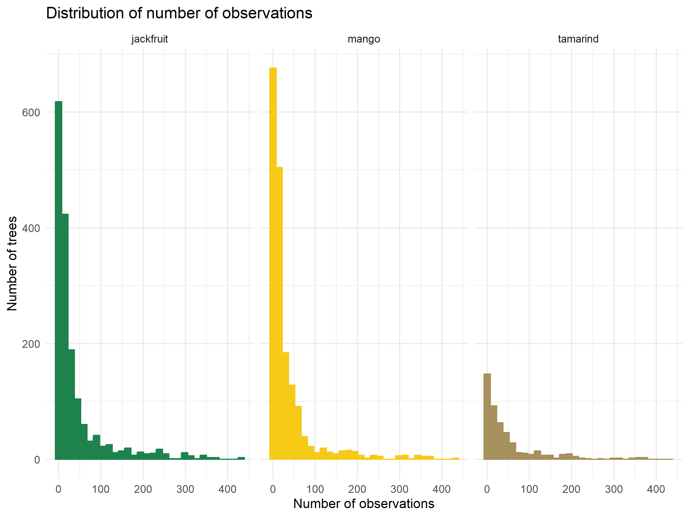

`r reg_obs_legend`

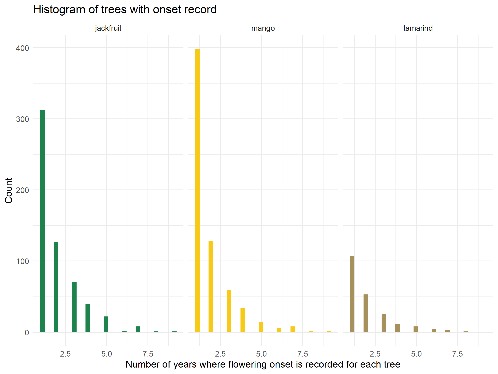

`r onset_yr_legend`

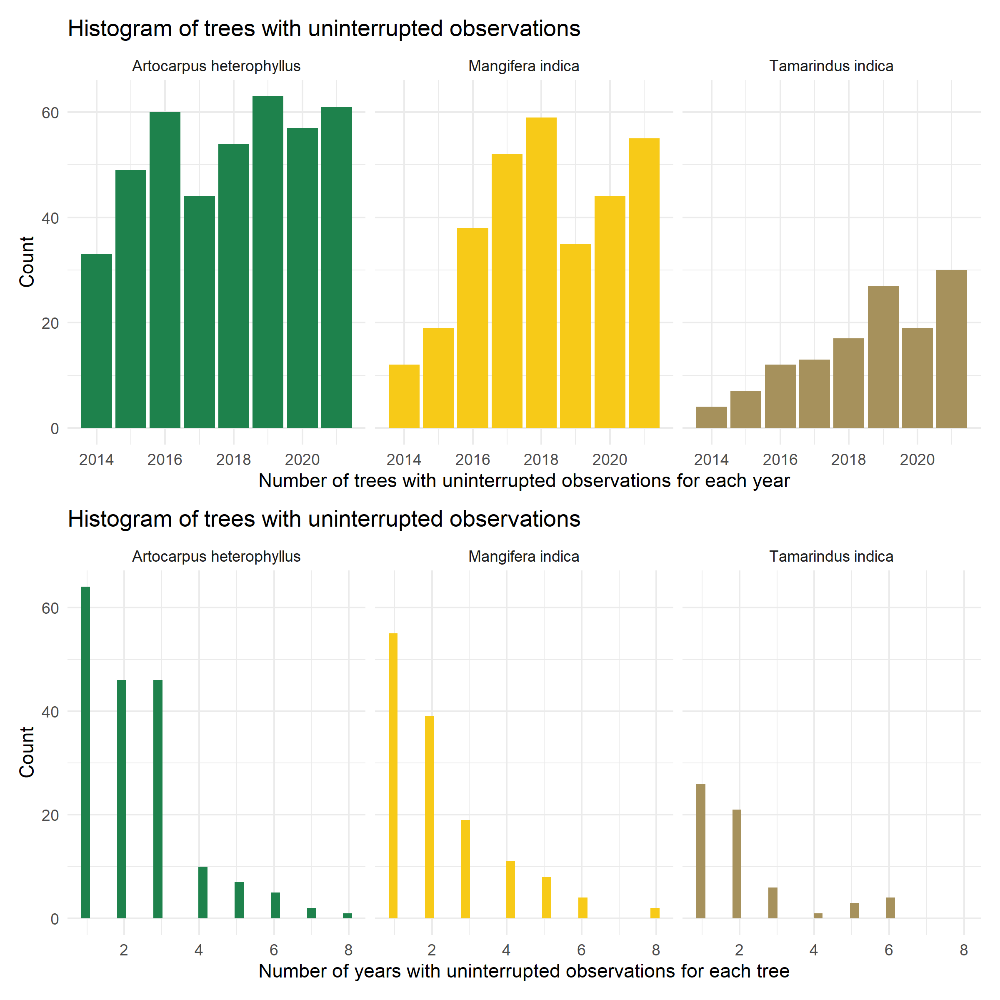

`r uninterrupted_legend`

\newpage

## `r data_cleaning_methods_title`

### Geographic location of points
To validate the geographic location of the data points, we included all the points that were already in Kerala as per the geographic location. 
From the remaining points, for any that had no location information, we excluded those that were single observations of trees, because of no alternate way to fill these. 
For regular observations with unconfirmed locations, we filled them with lat/longs from the same tree if available in later observations, or the average lat/long from other trees reported by the same user. 
As majority of the users were school students observing trees on foot, all regular trees observed by the same user tend to be highly clustered (< 1 km), allowing us to reliably fill an average lat/long from other trees when no observation of a tree had a lat/long.
Finally, if no trees by the user had accurate lat/long values and if they were by users who can be located through Google maps (schools or other institutions), we used a geocoding software on Google Sheets, Awesome Table Geocode, to fill these values.
We then manually validated these with help from the field coordinator for Kerala.
We excluded observations that could not be filled or verified by these methods.

\newpage

## `r env_vars_appendix_title`

### Climate Data Column Descriptions

All climate data was calculated on the daily time step for 0.1° pixels and aggregated to the fortnightly, monthly, and quarterly timesteps. 
A summary of the daily climate data is shown below:  
* PCP = Total daily precipitation (in meters)  
* MinTemp = Minimum daily temperature (in Kelvin)  
* MeanTemp = Average daily temperature (in Kelvin)  
* MaxTemp = Maximum daily temperature (in Kelvin)  
* MeanSM = Average daily soil moisture (the top 1m of the soil column in volumetric soil water content: m3/m3)  
* SolarRad = Total surface net solar radiation (in J/m2)  
* DryDays = Maximum consecutive days with PCP < 1mm (trace amounts are a common artefact in climate reanalysis data)  

For more information about these variables (except dry days, which was calculated from PCP), see https://developers.google.com/earth-engine/datasets/catalog/ECMWF_ERA5_LAND_HOURLY 

Each variable has a fortnightly, monthly, and quarterly aggregation. Precipitation and Solar Radiation are accumulated totals (i.e., sum) while the temperature and soil moisture variables are averages. Columns abbreviated “FN” indicate fortnightly, “MN” indicates monthly and “QR” indicates quarterly. For example, “FNMean_MaxTemp” indicates that the mean Maximum Daily Temperature value was taken for the previous fortnight. “QrSum_PCP” indicates that the sum of daily total precipitation was taken for the previous quarter.

Static Data Column Descriptions
* light_vals = Static variable. NASA satellite-derived lights dataset as a proxy for urban density  
* elev = Static variable. Elevation above mean sea level derived from 30m SRTM   
* slope = Static variable. Rise/run of elevation dataset  
* aspect = Static variable. Direction of slope     

Observation-Level Data

The dataset includes the Grid_ID and Fortnight they belong to, the observation ID, date of observation, species name, latitude, longitude, the response variables (fl_binary, fl_intensity) and the climate indicators.
FN: Previous 14 days before date of observation
MN: Previous 30 days before date of observation
Qr: Previous 90 days before date of observation


`r weekly_clim_legend`

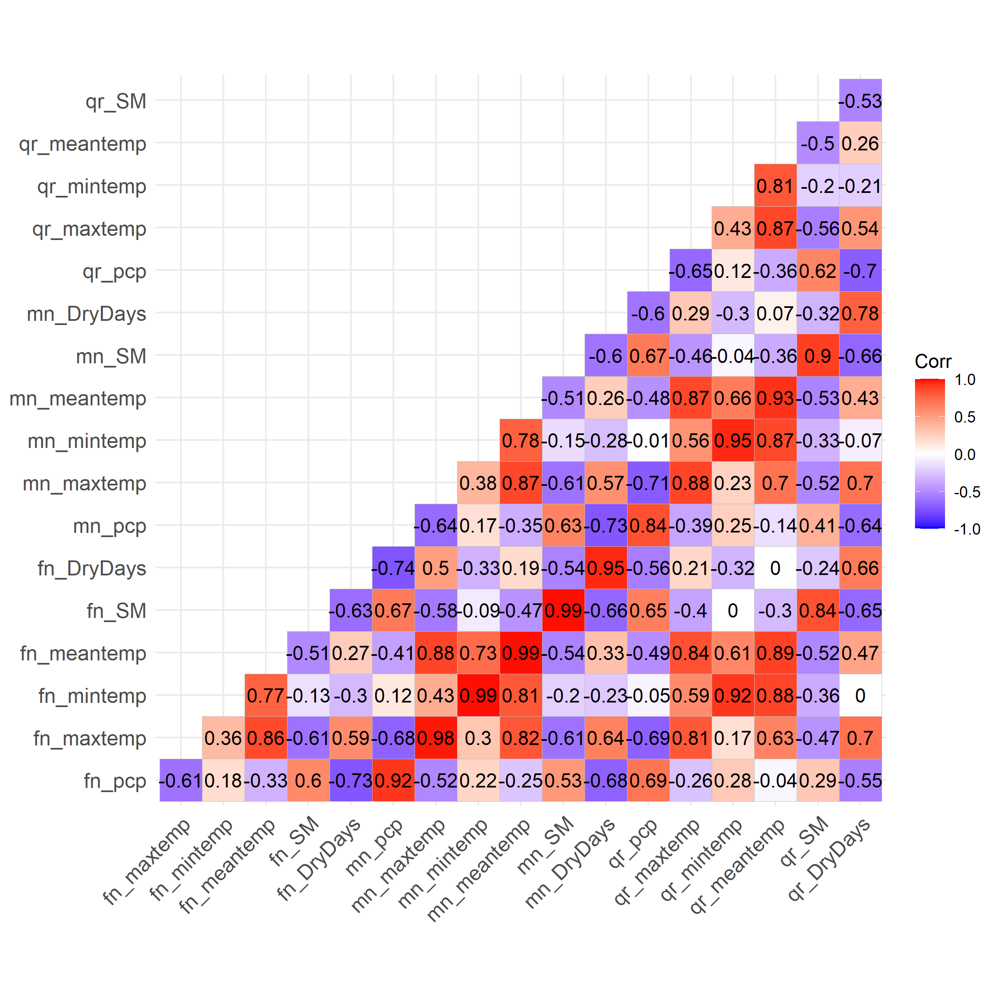

`r env_corrs_legend`


\newpage

## `r confusion_matrix_appendix_title`

For the entire set of observations, we used Random Forest models to classify the flowering occurrence observations based on environmental predictors.
Random Forest classifier is a supervised learning algorithm that uses an ensemble of decision trees using majority voting to classify datasets into two categories; here the presence/absence of flowering [@breiman_random_2001]. 
Random Forest classifiers have been used widely in ecological data analysis because of their flexibility and accuracy [@cutler_random_2007]. This approach allows for predicting the probability of observing flowering in a tree given recent environmental conditions.

For each of the three species, we ran separate models to classify flowering status according to the following model:

$$
\begin{aligned}
phenophase_{l,t} \sim precipitation_{l,t} + 
maximum temperature_{l,t} + 
minimum temperature_{l,t} + 
mean temperature_{l,t} + \\
dry days_{l,t} + 
soil moisture_{l,t} +
solar radiation_{l,t}
\end{aligned}
$$

Where precipitation, temperature, dry days, soil moisture, solar radiation are temporal predictors for the fortnight before the observation at location $l$ and time $t$.
We ran these models in R using the package *randomForest* [@liaw_classification_2002] for 500 decision trees. 
Tree-based methods are fairly insensitive to collinearity among predictors, allowing us to compare the full-range of temperature and precipitation variables simultaneously, as well as the full dataset, including repeat observations for the same tree. 

We calculated variable importance for each model using the Mean Decrease in Accuracy (MDA) metric which removes a predictor from the model, re-trains the model to make predictions, and evaluates the decrease in accuracy.

Machine learning models with spatiotemporal predictors were able to classify flowering phenophases for the three species with substantial precision. 
The accuracy of a binary model by random chance would be 50%, leading to an F1 score of 0.5; models with higher F1 scores than randomly expected have predictive value. 
With 500 runs each, Random Forest models were able to predict the presence/absence of flowering in jackfruit, mango, and tamarind trees given the environmental conditions of the previous fortnight with F1 scores of 0.59, 0.62, and 0.26, respectively. 
These performance metrics describe the ability of the models to predict tree phenophases for an unobserved year based on environmental variables alone. 
We note that the distribution between flowering and no-flowering observations was about 2:1, potentially influencing the F1 score.

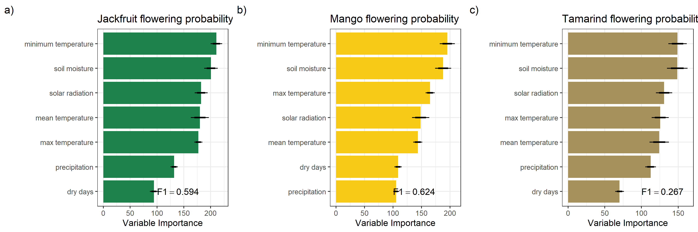
`r variable_imp_fig_legend`

Random forest models identified environmental variables strongly correlated with flowering for each of the species. 
The mean importance of each of the factors, calculated using MDA, was different across species.
For all three species, minimum temperature in the preceding fortnight was the most important predictor of flowering status.
Among precipitation variables, soil moisture in the preceding fortnight had the strongest influence in classifying flowering status.
Solar radiation also ranked among the top three variables for all three species.
Across the 9 LOOCV runs, the relative importance of the variables had some variation, but total precipitation and the number of consecutive dry in the previous fortnight consistently were ranked lowest across runs in all species.
Some of the variation in importance was also potentially influenced by the difference in number of observations across the years, with 2014 being the lowest sample.


`r jack_variable_importance_legend`
```{r eval = TRUE, echo=FALSE, warning=FALSE, message=F}
library(knitr)
library(kableExtra)
library(tidyverse)
S1 <- read.csv("../models/ML/vimp_jack_noyr.csv", stringsAsFactors = FALSE, check.names = FALSE)
S1_t <- as.data.frame(t(S1[, 2:ncol(S1)]))
colnames(S1_t) <- S1$var

S1_t <- S1_t %>%
  dplyr::rename(
    "precipitation" = "precip",
    "max \ntemperature" = "max_temp",
    "soil \nmoisture" = "soil_moisture",
    "dry days" = "dry_days",
    "minimum \ntemperature" = "min_temp",
    "mean \ntemperature" = "mean_temp",
    "solar \nradiation" = "solar_rad"
  )

# colnames(S2)<-c("districtID", "paperID", "DOI", "State", "District")
kable(S1_t, format = "latex", booktabs = TRUE, escape = F) %>%
  # column_spec(1, width = "3cm") %>%
  # column_spec(2, width = "2cm") %>%
  # column_spec(3, width = "2cm") %>%
  # column_spec(4, width = "1.5cm") %>%
  kable_styling(latex_options = c("scale_down", "hold_position"), protect_latex = T)
```

`r mango_variable_importance_legend`

```{r eval = TRUE, echo=FALSE, warning=FALSE, message=F}
S2 <- read.csv("../models/ML/vimp_mango_noyr.csv", stringsAsFactors = FALSE, check.names = FALSE)
S2_t <- as.data.frame(t(S2[, 2:ncol(S2)]))
colnames(S2_t) <- S2$var

S2_t <- S2_t %>%
  dplyr::rename(
    "precipitation" = "precip",
    "max \ntemperature" = "max_temp",
    "soil \nmoisture" = "soil_moisture",
    "dry days" = "dry_days",
    "minimum \ntemperature" = "min_temp",
    "mean \ntemperature" = "mean_temp",
    "solar \nradiation" = "solar_rad"
  )

kable(S2_t, format = "latex", booktabs = TRUE, escape = F) %>%
  kable_styling(latex_options = c("scale_down", "hold_position"), protect_latex = T)
```

`r tam_variable_importance_legend`

```{r eval = TRUE, echo=FALSE, warning=FALSE, message=F}
S3 <- read.csv("../models/ML/vimp_tam_noyr.csv", stringsAsFactors = FALSE, check.names = FALSE)
S3_t <- as.data.frame(t(S3[, 2:ncol(S3)]))
colnames(S3_t) <- S3$var

S3_t <- S3_t %>%
  dplyr::rename(
    "precipitation" = "precip",
    "max \ntemperature" = "max_temp",
    "soil \nmoisture" = "soil_moisture",
    "dry days" = "dry_days",
    "minimum \ntemperature" = "min_temp",
    "mean \ntemperature" = "mean_temp",
    "solar \nradiation" = "solar_rad"
  )

# colnames(S2)<-c("districtID", "paperID", "DOI", "State", "District")
kable(S3_t, format = "latex", booktabs = TRUE, escape = F) %>%
  # column_spec(1, width = "3cm") %>%
  # column_spec(2, width = "2cm") %>%
  # column_spec(3, width = "2cm") %>%
  # column_spec(4, width = "1.5cm") %>%
  kable_styling(latex_options = c("scale_down", "hold_position"), protect_latex = T)
```

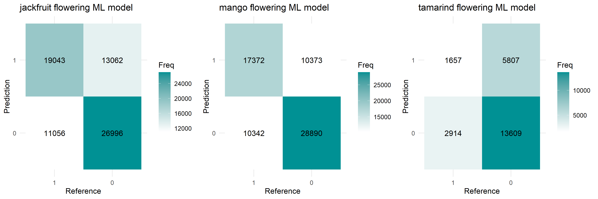

`r confusion_matrix_legend`

\newpage

## `r glmm_results_appendix_title`

```{r, echo=FALSE, warning=FALSE, message=F, eval=F}
library(sjPlot)
library(sjmisc)
library(html2latex)
library(rlist)
library(XML)
library(tidyverse)


sjPlot::tab_model(
  jack_bin_start,
  show.r2 = TRUE,
  show.icc = TRUE,
  show.re.var = TRUE,
  p.style = "scientific",
  emph.p = TRUE,
  file = "../models/onset_models/temp.html"
)

tables <- list.clean(readHTMLTable("../models/onset_models/temp.html"), fun = is.null, recursive = FALSE)
tables2 <- tables[[1]] %>% janitor::row_to_names(row_number = 1)
tables2 <- as.matrix(tables2) %>% as_tibble()
tables2[is.na(tables2)] <- ""

knitr::kable(tables2,
  format = "latex",
  booktabs = TRUE,
  col.names = names(tables2),
  align = c("l", rep("c", length(names(tables2)) - 1)),
  caption = "Effects of environmental variables on the onset of jackfruit flowering"
)

# html2pdf("../models/onset_models/temp.html", build_pdf = F, silent=T)


# tab_model(jack_bin_start)
# tab_model(mango_bin_start)
# tab_model(tam_bin_start)
```

`r jack_ests_legend`

```{r echo=FALSE, warning=FALSE, message=F}
library(parameters)
# read models
jack_bin_start <- readRDS("../models/onset_models/jack_full_month_first.RDS")
# mango_bin_start<-readRDS("../models/onset_models/mango_full.RDS")
# tam_bin_start<-readRDS("../models/onset_models/tam_full.RDS")

mp <- model_parameters(jack_bin_start)
# print_html(mp)
print_md(mp)
```

`r mango_ests_legend`

```{r echo=FALSE, warning=FALSE, message=F}
library(parameters)
# read models
# jack_bin_start<-readRDS("../models/onset_models/jack_full.RDS")
mango_bin_start <- readRDS("../models/onset_models/mango_full_month_first.RDS")
# tam_bin_start<-readRDS("../models/onset_models/tam_full.RDS")

mp <- model_parameters(mango_bin_start)
# print_html(mp)
print_md(mp)
```

`r tam_ests_legend`

```{r echo=FALSE, warning=FALSE, message=F}
library(parameters)
# read models
tam_bin_start <- readRDS("../models/onset_models/tam_full_month_first.RDS")

mp <- model_parameters(tam_bin_start)
# print_html(mp)
print_md(mp)
```


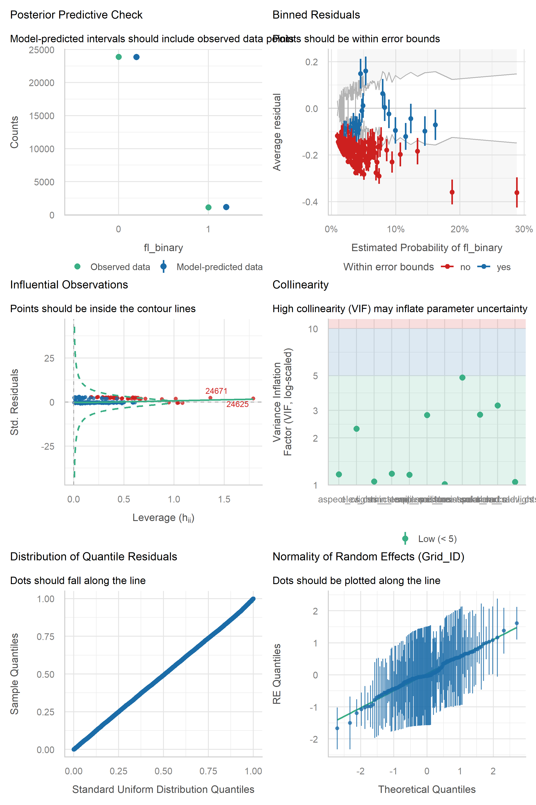{width=75%}
`r jack_diag_legend`

\newpage

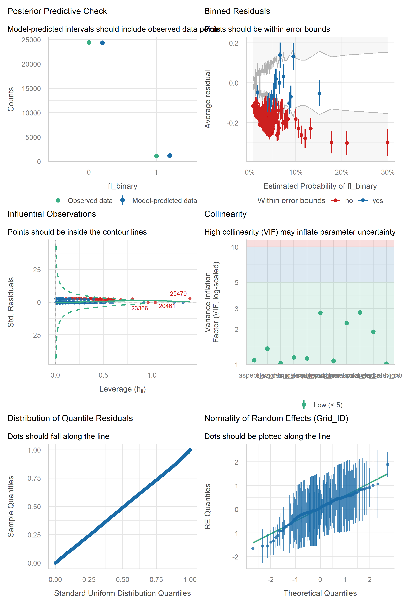{width=75%}
`r mango_diag_legend`

\newpage

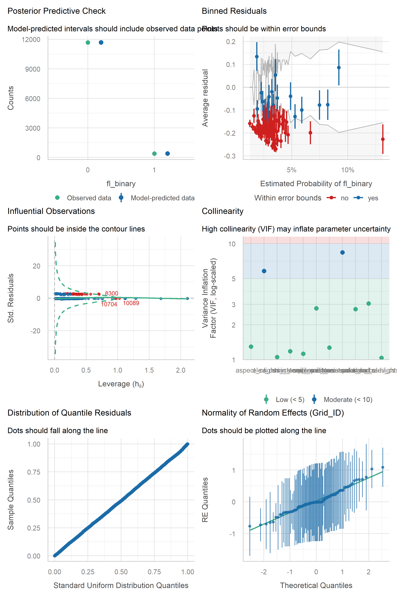{width=75%}
`r tam_diag_legend`

\newpage

\blandscape
## `r glmm_loocv_appendix_title`

`r jack_estsloocv_legend`

```{r eval = TRUE, echo=FALSE, warning=FALSE, message=F}
S4 <- read.csv("../models/onset_models/jack_first_loocv_ests.csv", stringsAsFactors = FALSE, check.names = FALSE)
# S4 <- read.csv("models/onset_models/jack_first_loocv_ests.csv", stringsAsFactors = FALSE, check.names = FALSE)

S4 <- S4 %>% dplyr::mutate(across(where(is.numeric), round, 2))

# combine columns for same year with +/- sign
S5 <- S4 %>%
  pivot_longer(cols = -var) %>%
  mutate(
    # pick last 4 characters of the name
    year = substr(name, nchar(name) - 3, nchar(name)),
    # pick all but last 5 characters
    type = substr(name, 1, nchar(name) - 5)
  ) %>%
  select(-name) %>%
  pivot_wider(names_from = type, values_from = value) %>%
  dplyr::mutate(estimate = paste0(ests, " (", std_er, ")")) %>%
  select(-ests, -std_er) %>%
  pivot_wider(names_from = year, values_from = estimate)

# head(S5)

library(flextable)
ft <- flextable(S5)
ft <- fontsize(ft, size = 8)
ft <- width(ft, j = 1, width = 1.5) # first column is variable name
ft
```


`r mango_estsloocv_legend`

```{r eval = TRUE, echo=FALSE, warning=FALSE, message=F}
S5 <- read.csv("../models/onset_models/mango_first_loocv_ests.csv", stringsAsFactors = FALSE, check.names = FALSE)
S5 <- S5 %>% dplyr::mutate(across(where(is.numeric), round, 2))
# combine columns for same year with +/- sign
S6 <- S5 %>%
  pivot_longer(cols = -var) %>%
  mutate(
    # pick last 4 characters of the name
    year = substr(name, nchar(name) - 3, nchar(name)),
    # pick all but last 5 characters
    type = substr(name, 1, nchar(name) - 5)
  ) %>%
  select(-name) %>%
  pivot_wider(names_from = type, values_from = value) %>%
  dplyr::mutate(estimate = paste0(ests, " (", std_er, ")")) %>%
  select(-ests, -std_er) %>%
  pivot_wider(names_from = year, values_from = estimate)

# head(S5)

library(flextable)
ft <- flextable(S6)
ft <- fontsize(ft, size = 8)
ft <- width(ft, j = 1, width = 1.5) # first column is variable name
ft
```

`r tam_estsloocv_legend`

```{r eval = TRUE, echo=FALSE, warning=FALSE, message=F}
S6 <- read.csv("../models/onset_models/tam_first_loocv_ests.csv", stringsAsFactors = FALSE, check.names = FALSE)
S6 <- S6 %>% dplyr::mutate(across(where(is.numeric), round, 2))

# combine columns for same year with +/- sign
S7 <- S6 %>%
  pivot_longer(cols = -var) %>%
  mutate(
    # pick last 4 characters of the name
    year = substr(name, nchar(name) - 3, nchar(name)),
    # pick all but last 5 characters
    type = substr(name, 1, nchar(name) - 5)
  ) %>%
  select(-name) %>%
  pivot_wider(names_from = type, values_from = value) %>%
  dplyr::mutate(estimate = paste0(ests, " (", std_er, ")")) %>%
  select(-ests, -std_er) %>%
  pivot_wider(names_from = year, values_from = estimate)

# head(S5)

# library(flextable)
ft <- flextable(S7)
ft <- fontsize(ft, size = 8)
ft <- width(ft, j = 1, width = 1.5) # first column is variable name
ft
```
\elandscape

\newpage
`r jack_mse_legend`

```{r eval = TRUE, echo=FALSE, warning=FALSE, message=F}
S <- read.csv("../models/onset_models/jack_first_loocv_mse.csv")
S <- S[, c("year", "cor", "mse")]

knitr::kable(S, format = "latex", booktabs = TRUE, escape = F) # %>%
# kable_styling(latex_options = c("scale_down", "hold_position"), protect_latex = T)
```

`r mango_mse_legend`
```{r eval = TRUE, echo=FALSE, warning=FALSE, message=F}
S <- read.csv("../models/onset_models/mango_first_loocv_mse.csv")
S <- S[, c("year", "cor", "mse")]

knitr::kable(S, format = "latex", booktabs = TRUE, escape = F) # %>%
# kable_styling(latex_options = c("scale_down", "hold_position"), protect_latex = T)
```

`r tam_mse_legend`
```{r eval = TRUE, echo=FALSE, warning=FALSE, message=F}
S <- read.csv("../models/onset_models/tam_first_loocv_mse.csv")
S <- S[, c("year", "cor", "mse")]

knitr::kable(S, format = "latex", booktabs = TRUE, escape = F) # %>%
# kable_styling(latex_options = c("scale_down", "hold_position"), protect_latex = T)
```


\newpage

## References